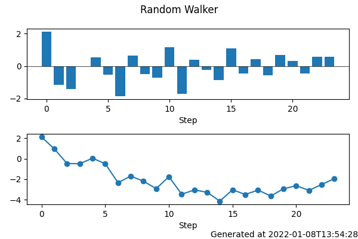
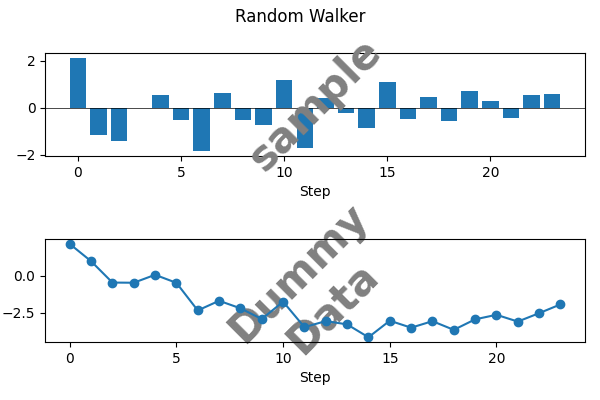

# magoplotlib

Attentive External Library of [matplotlib](https://matplotlib.org/stable/index.html)

## Features

- plotting timestamp on a Figure. (right bottom). `add_timestamp`



- plotting message on an Axes. `add_message`



## Requirements

- matplotlib

## Installation

```
pip install magoplotlib
```

## Usage

```python
from magoplotlib import add_timestamp

add_timestamp(fig)
```
